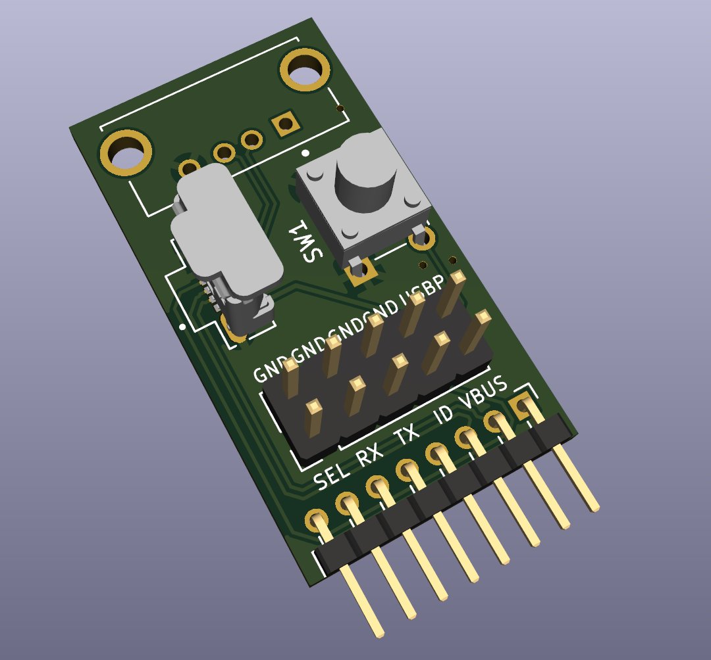

# Dreame Breakout

This is a cheaper version of the original [valetudo-dreameadapter](https://github.com/Hypfer/valetudo-dreameadapter)
for rooting dreame robots.

It is optimized for manufacturing and can be completely assembled by JLC using the files in "production".
For that reason, it is less useful for developers and really only the minimum needed for user to root a bot.

I'll update this readme once someone tested it to actually work.
